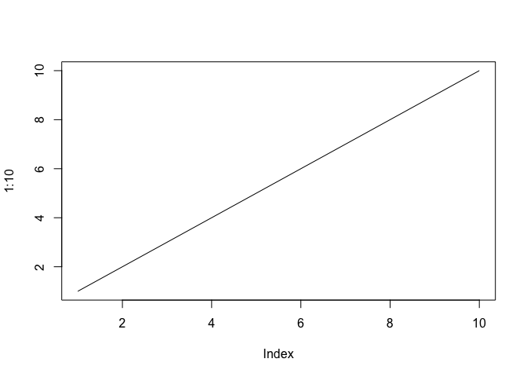
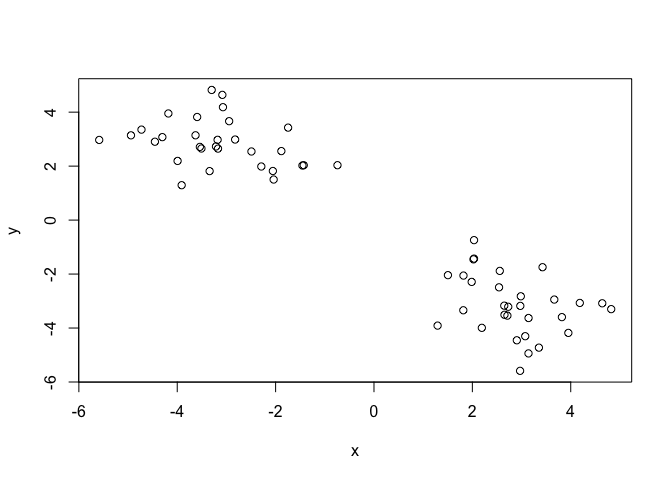
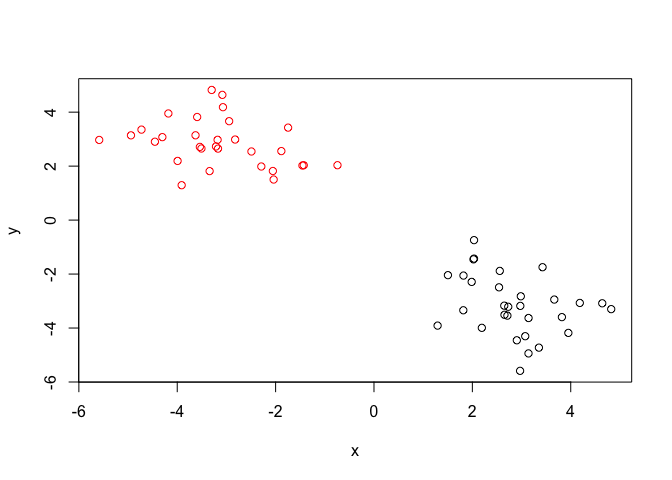
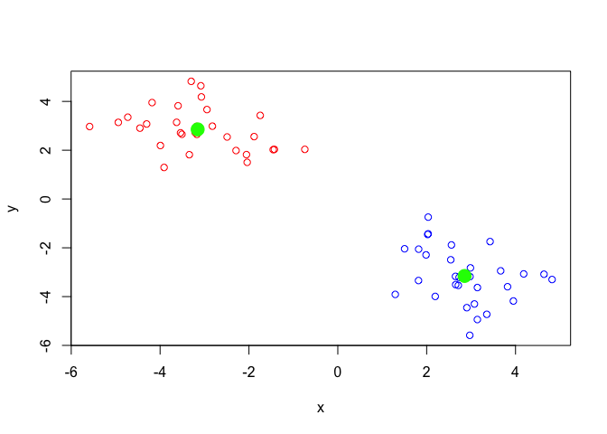
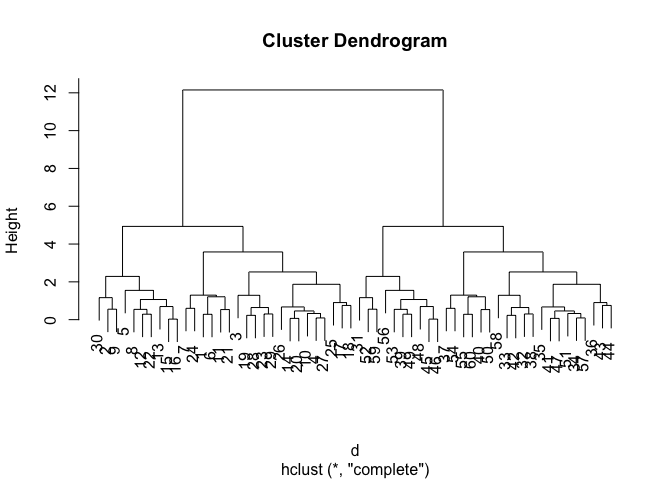
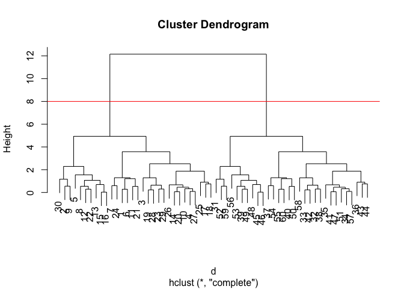
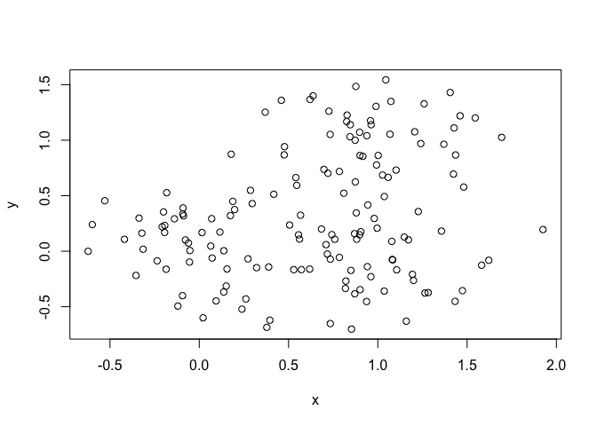
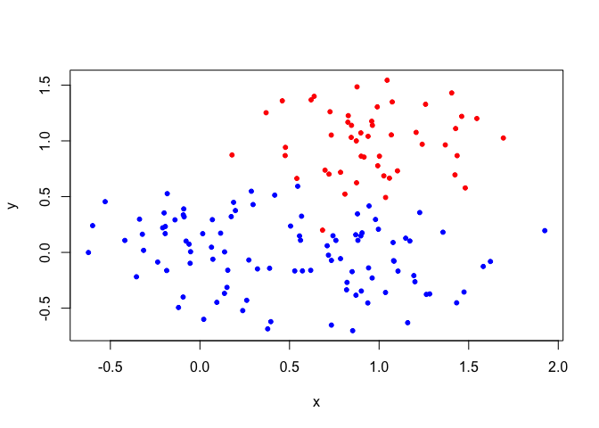
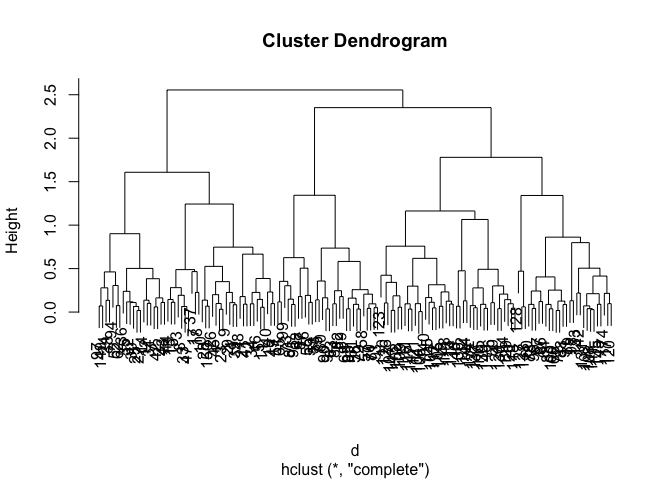
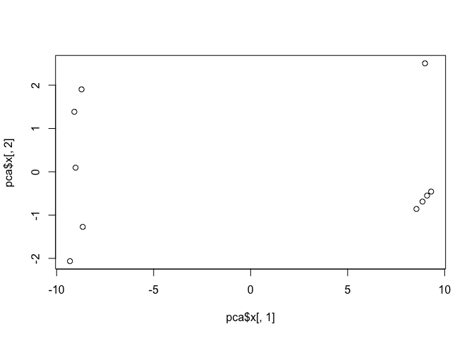

Class 8
================
Tavleen Takhar
10/25/2018

K-mean Clustering
-----------------

Our first example with **kmeans()** function

``` r
# Example plot to see how Rmarkdown works
plot(1:10, typ="l")
```



Back to Kmeans...

``` r
# Generate some example data for clustering
tmp <- c(rnorm(30,-3), rnorm(30,3))
x <- cbind(x=tmp, y=rev(tmp))

plot(x)
```



``` r
k <- kmeans(x, center=2, nstart=20)
k
```

    ## K-means clustering with 2 clusters of sizes 30, 30
    ## 
    ## Cluster means:
    ##          x        y
    ## 1  2.85342 -3.15405
    ## 2 -3.15405  2.85342
    ## 
    ## Clustering vector:
    ##  [1] 2 2 2 2 2 2 2 2 2 2 2 2 2 2 2 2 2 2 2 2 2 2 2 2 2 2 2 2 2 2 1 1 1 1 1
    ## [36] 1 1 1 1 1 1 1 1 1 1 1 1 1 1 1 1 1 1 1 1 1 1 1 1 1
    ## 
    ## Within cluster sum of squares by cluster:
    ## [1] 59.16602 59.16602
    ##  (between_SS / total_SS =  90.1 %)
    ## 
    ## Available components:
    ## 
    ## [1] "cluster"      "centers"      "totss"        "withinss"    
    ## [5] "tot.withinss" "betweenss"    "size"         "iter"        
    ## [9] "ifault"

How many points are in each cluster?
====================================

``` r
k$size
```

    ## [1] 30 30

What component of your result object details for assignment/membership?
=======================================================================

``` r
k$cluster
```

    ##  [1] 2 2 2 2 2 2 2 2 2 2 2 2 2 2 2 2 2 2 2 2 2 2 2 2 2 2 2 2 2 2 1 1 1 1 1
    ## [36] 1 1 1 1 1 1 1 1 1 1 1 1 1 1 1 1 1 1 1 1 1 1 1 1 1

What component of your result objects details for cluster center?
=================================================================

``` r
k$centers
```

    ##          x        y
    ## 1  2.85342 -3.15405
    ## 2 -3.15405  2.85342

``` r
plot(x, col=k$cluster)
```



``` r
palette(c("blue", "red"))
plot(x, col=k$cluster)
points(k$centers, col="green", pch=20, cex=3)
```



``` r
k <- kmeans(x, center=2, nstart=20)
k3 <- kmeans(x, center=3, nstart=20)
k$tot.withinss
```

    ## [1] 118.332

``` r
k3$tot.withinss
```

    ## [1] 89.23812

Hierarchial Clustering in R
===========================

``` r
d <- dist(x)
hc <- hclust(d)
plot(hc)
```



``` r
plot(hc)
abline(h=8, col="red")
```



``` r
cutree(hc, h=8)
```

    ##  [1] 1 1 1 1 1 1 1 1 1 1 1 1 1 1 1 1 1 1 1 1 1 1 1 1 1 1 1 1 1 1 2 2 2 2 2
    ## [36] 2 2 2 2 2 2 2 2 2 2 2 2 2 2 2 2 2 2 2 2 2 2 2 2 2

### A more "real" example of data clustering

``` r
# Step 1. Generate some example data for clustering
x <- rbind(
 matrix(rnorm(100, mean=0, sd = 0.3), ncol = 2), # c1
 matrix(rnorm(100, mean = 1, sd = 0.3), ncol = 2), # c2
 matrix(c(rnorm(50, mean = 1, sd = 0.3), # c3
 rnorm(50, mean = 0, sd = 0.3)), ncol = 2))
colnames(x) <- c("x", "y")
# Step 2. Plot the data without clustering
plot(x)
```



``` r
# Step 3. Generate colors for known clusters
# (just so we can compare to hclust results)
col <- as.factor( rep(c("c1","c2","c3"), each=50) )
plot(x, col=col, pch=20)
```



``` r
d <- dist(x)
hc <- hclust(d)
plot(hc)
```



``` r
grp.2 <- cutree(hc, k=2)
grp.3 <- cutree(hc, k=3)
plot(hc)
```


``` r
table(grp.3, col)
```

    ##      col
    ## grp.3 c1 c2 c3
    ##     1 46  4  2
    ##     2  4 16 48
    ##     3  0 30  0

Principal Component Analysis
============================

``` r
## Initialize a blank 100 row by 10 column matrix
mydata <- matrix(nrow=100, ncol=10)
## Lets label the rows gene1, gene2 etc. to gene100
rownames(mydata) <- paste("gene", 1:100, sep="")
## Lets label the first 5 columns wt1, wt2, wt3, wt4 and wt5
## and the last 5 ko1, ko2 etc. to ko5 (for "knock-out")
colnames(mydata) <- c( paste("wt", 1:5, sep=""),
 paste("ko", 1:5, sep="") )
## Fill in some fake read counts
for(i in 1:nrow(mydata)) {
 wt.values <- rpois(5, lambda=sample(x=10:1000, size=1))
 ko.values <- rpois(5, lambda=sample(x=10:1000, size=1))

 mydata[i,] <- c(wt.values, ko.values)
}
head(mydata)
```

    ##       wt1 wt2 wt3 wt4 wt5 ko1  ko2 ko3 ko4 ko5
    ## gene1 129 100 112  94  94 142  160 156 172 152
    ## gene2 446 437 477 469 451 981 1004 935 975 965
    ## gene3 791 826 863 781 805 126   86 105 115  97
    ## gene4 235 235 211 232 257 573  600 600 615 595
    ## gene5 766 803 835 782 802 502  487 478 456 478
    ## gene6 689 661 618 654 754  32   43  35  26  26

Now lets try to find structure in this dat
==========================================

``` r
head(t(mydata))
```

    ##     gene1 gene2 gene3 gene4 gene5 gene6 gene7 gene8 gene9 gene10 gene11
    ## wt1   129   446   791   235   766   689   763   582   639     33     36
    ## wt2   100   437   826   235   803   661   790   606   630     33     30
    ## wt3   112   477   863   211   835   618   761   559   658     52     44
    ## wt4    94   469   781   232   782   654   795   581   623     37     41
    ## wt5    94   451   805   257   802   754   775   583   619     37     34
    ## ko1   142   981   126   573   502    32   292   745    74    163    164
    ##     gene12 gene13 gene14 gene15 gene16 gene17 gene18 gene19 gene20 gene21
    ## wt1    284    151    414    672     78    323    175    139    408     20
    ## wt2    334    175    377    595     91    346    149    140    340     22
    ## wt3    335    159    394    669     88    360    150    142    372     23
    ## wt4    329    181    399    697     96    361    137    133    362     20
    ## wt5    337    174    410    659     86    369    164    127    397     18
    ## ko1    646    921    612    713    393    639    476    319    154    375
    ##     gene22 gene23 gene24 gene25 gene26 gene27 gene28 gene29 gene30 gene31
    ## wt1    491    353    105    769    865     80    542    115   1063    313
    ## wt2    551    379    104    830    846     74    540    109    931    405
    ## wt3    526    351     91    775    786     91    577    112    967    368
    ## wt4    510    356     93    741    824     61    574    121    985    355
    ## wt5    561    343     92    757    918     70    564    109    901    335
    ## ko1    963     90    294    338    432    559    642    775    831    520
    ##     gene32 gene33 gene34 gene35 gene36 gene37 gene38 gene39 gene40 gene41
    ## wt1    217    946    571    858     67    573    765     32    593    358
    ## wt2    227    978    631    867     61    544    803     33    535    318
    ## wt3    244    953    578    867     58    560    772     33    547    360
    ## wt4    251    918    636    872     64    540    743     38    584    372
    ## wt5    228    994    603    839     77    571    755     31    580    330
    ## ko1    532    624    679    756    135     31    454    673    173    368
    ##     gene42 gene43 gene44 gene45 gene46 gene47 gene48 gene49 gene50 gene51
    ## wt1    325     25    771   1021    985    623    495    943    430    737
    ## wt2    351     31    751   1008    969    622    496    919    406    766
    ## wt3    327     23    770    971    993    635    439    924    378    741
    ## wt4    308     21    768    981    965    611    471    958    442    763
    ## wt5    319     28    751   1001    981    617    470    941    445    702
    ## ko1    174    938    203    501    122    775    282    130    561    749
    ##     gene52 gene53 gene54 gene55 gene56 gene57 gene58 gene59 gene60 gene61
    ## wt1    236     69    408    947    476    891    313    770     30    318
    ## wt2    271     83    468    985    458    940    310    805     35    335
    ## wt3    266     76    404    993    477    951    302    808     38    284
    ## wt4    272     64    394    978    502    842    318    796     38    335
    ## wt5    281     72    400    972    456    893    296    713     50    328
    ## ko1    103    773    301     58     19    895    881    940    908    289
    ##     gene62 gene63 gene64 gene65 gene66 gene67 gene68 gene69 gene70 gene71
    ## wt1    236    687    160    878    356    705    861    247    958    646
    ## wt2    219    691    157    902    394    698    793    270    918    648
    ## wt3    221    646    172    906    385    689    831    280    900    603
    ## wt4    202    618    177    841    361    654    838    306    937    605
    ## wt5    220    701    164    856    391    664    818    278    922    639
    ## ko1    517    885    111    191    560    549    580    371    350     18
    ##     gene72 gene73 gene74 gene75 gene76 gene77 gene78 gene79 gene80 gene81
    ## wt1    540    702    120    817    534    466    992    422    504    260
    ## wt2    572    698     91    800    507    475    988    407    436    270
    ## wt3    570    734     93    822    533    471    948    417    441    234
    ## wt4    580    710    105    810    529    475    978    452    428    260
    ## wt5    546    672    107    816    533    433    972    431    460    237
    ## ko1     60    635    138    915    182    395    523     24    491    702
    ##     gene82 gene83 gene84 gene85 gene86 gene87 gene88 gene89 gene90 gene91
    ## wt1     18    434    162    595    301    125    619    204    396    400
    ## wt2     19    429    126    611    304    112    616    223    349    352
    ## wt3     17    459    110    621    292    104    633    219    409    363
    ## wt4     26    431    139    631    306    134    628    228    396    349
    ## wt5     19    439    144    633    305    119    623    212    364    345
    ## ko1    795    958    674    929    279    226    544    347    629    281
    ##     gene92 gene93 gene94 gene95 gene96 gene97 gene98 gene99 gene100
    ## wt1    985    286    260    813    620    429    685    443     573
    ## wt2   1048    264    259    759    623    455    642    458     571
    ## wt3    975    265    256    824    623    423    593    446     581
    ## wt4    976    309    246    817    609    444    632    390     538
    ## wt5   1035    260    234    828    637    434    652    443     572
    ## ko1    464    705    212     66    761    900    891    548     306

``` r
pca <- prcomp(t(mydata), scale=TRUE)
pca
```

    ## Standard deviations (1, .., p=10):
    ##  [1] 9.446374e+00 1.469253e+00 1.440998e+00 1.321478e+00 1.234039e+00
    ##  [6] 1.098832e+00 9.806720e-01 8.220532e-01 6.455761e-01 3.439706e-15
    ## 
    ## Rotation (n x k) = (100 x 10):
    ##                  PC1           PC2           PC3           PC4
    ## gene1    0.095565258  1.435533e-01  0.0644491489 -2.155792e-01
    ## gene2    0.105560926  7.703253e-03  0.0046427340 -9.672523e-03
    ## gene3   -0.105609077 -4.555597e-03 -0.0169434114  1.182155e-02
    ## gene4    0.105506928  7.007827e-05  0.0105085213 -2.739371e-02
    ## gene5   -0.104999811 -4.373784e-02 -0.0195926630  3.157510e-02
    ## gene6   -0.105184623 -1.287411e-02  0.0282938624  4.642066e-02
    ## gene7   -0.105680213 -9.724160e-03 -0.0084444525  9.673254e-03
    ## gene8    0.100070813  2.454162e-02 -0.0928472566  7.446260e-02
    ## gene9   -0.105771213  9.333509e-03 -0.0059446039  4.886414e-03
    ## gene10   0.105290861  2.523750e-02 -0.0171160140 -4.342292e-02
    ## gene11   0.105528056 -1.831098e-03 -0.0071070519  1.359959e-02
    ## gene12   0.105204975 -5.210362e-02 -0.0155795560 -2.194591e-02
    ## gene13   0.105782111 -4.507366e-03 -0.0071219170 -2.148518e-02
    ## gene14   0.105157733  1.066668e-02  0.0401499219 -1.140069e-02
    ## gene15   0.066415035  4.003125e-01  0.0913113863  2.268464e-01
    ## gene16   0.104772795 -9.293143e-03 -0.0277222864  5.862408e-02
    ## gene17   0.104682309  1.233533e-02 -0.0084813135 -1.852550e-02
    ## gene18   0.105293955 -3.550757e-02  0.0462491872 -2.757665e-02
    ## gene19   0.105304350 -2.410122e-02  0.0176181381 -4.280717e-02
    ## gene20  -0.104416157  3.329985e-02  0.0871409749  5.317709e-02
    ## gene21   0.105531715 -2.150591e-02  0.0108582661 -3.896447e-03
    ## gene22   0.105213990 -4.898949e-02  0.0059257580 -6.243777e-03
    ## gene23  -0.105631243 -1.270264e-02 -0.0225845141  1.881573e-02
    ## gene24   0.104919674  2.965289e-02 -0.0513006571 -1.505481e-02
    ## gene25  -0.105219909 -3.889667e-02 -0.0027218888 -4.203022e-02
    ## gene26  -0.104451263 -3.254713e-02  0.0331031052  6.928999e-02
    ## gene27   0.105646149 -1.518581e-02  0.0071580695 -4.315659e-03
    ## gene28   0.101600232 -8.735511e-03  0.0330174834 -8.717018e-03
    ## gene29   0.105742059 -6.463020e-04 -0.0040807707  1.579954e-02
    ## gene30  -0.085094924  1.790712e-01  0.1769944842 -1.396641e-01
    ## gene31   0.097924280 -5.439967e-02 -0.2463147538 -1.438905e-02
    ## gene32   0.104807973 -1.049843e-02 -0.0257437397  3.482114e-02
    ## gene33  -0.104128171 -4.746548e-02 -0.0261652490  6.582246e-02
    ## gene34   0.074481196 -4.459512e-02 -0.3719297588  2.758224e-01
    ## gene35  -0.102720925  5.745568e-02 -0.0832971245  8.201782e-02
    ## gene36   0.102878974 -9.832756e-02  0.0851553535  7.422131e-02
    ## gene37  -0.105707652  3.415439e-03  0.0113174630  2.153067e-02
    ## gene38  -0.105508390 -4.183214e-02 -0.0130108574 -9.947968e-03
    ## gene39   0.105699566 -9.221026e-03  0.0102409546  5.302652e-03
    ## gene40  -0.105245195  3.277012e-02  0.0183307843  5.025268e-02
    ## gene41   0.009468287  5.909824e-01 -0.1116323413  1.838333e-01
    ## gene42  -0.104656770 -2.370672e-02 -0.0162946615 -5.862663e-02
    ## gene43   0.105777636 -2.232007e-03 -0.0113462402  7.890220e-03
    ## gene44  -0.105689758  2.115201e-02 -0.0117745811  2.153034e-02
    ## gene45  -0.105254643 -4.112743e-02  0.0339540427 -1.309166e-03
    ## gene46  -0.105761784 -8.628093e-05  0.0062929902  2.573859e-02
    ## gene47   0.104096972 -5.796982e-02  0.0173355313 -3.439267e-02
    ## gene48  -0.104555541  6.217962e-03  0.0015605766 -8.144191e-03
    ## gene49  -0.105764120  1.281117e-02  0.0058798189  1.965678e-02
    ## gene50   0.101258663  4.366984e-02 -0.0015564460  1.408184e-01
    ## gene51   0.022078628  2.664618e-01 -0.5758144746 -1.354082e-01
    ## gene52  -0.104408359 -8.640395e-03 -0.0418087530  1.433635e-02
    ## gene53   0.105554881 -2.053682e-02  0.0146288247 -1.485010e-02
    ## gene54  -0.098167922 -7.874560e-02 -0.1638230735 -1.019437e-01
    ## gene55  -0.105782120  1.588672e-03 -0.0138191315  1.715213e-02
    ## gene56  -0.105640406  3.268705e-02 -0.0068092483  2.272409e-02
    ## gene57  -0.053636179 -3.263997e-01 -0.1844428938 -5.545613e-02
    ## gene58   0.105735569  2.926637e-03 -0.0086898329  1.186252e-02
    ## gene59   0.098286642 -3.160106e-02 -0.0688145606 -8.410023e-02
    ## gene60   0.105640963  2.660278e-03  0.0154796555 -2.685820e-02
    ## gene61  -0.080843360 -4.778912e-02 -0.0707222063  1.759795e-01
    ## gene62   0.105257436  5.431429e-03  0.0007689151  1.803765e-02
    ## gene63   0.098817682 -4.192890e-02  0.0162256026  7.528978e-03
    ## gene64  -0.097255873  8.873983e-03  0.0989985242  6.147544e-03
    ## gene65  -0.105764505 -1.446194e-02 -0.0075359656 -1.060293e-02
    ## gene66   0.104234258 -4.297720e-02 -0.0632288521 -2.924163e-02
    ## gene67  -0.101892699 -8.761169e-02  0.0214328207 -6.306870e-02
    ## gene68  -0.103011306  4.141917e-02 -0.0157834529  9.109731e-02
    ## gene69   0.101165296  9.966939e-03  0.0024791931 -8.423509e-02
    ## gene70  -0.105572209  8.676003e-03  0.0080138933  4.368727e-02
    ## gene71  -0.105735747 -8.506979e-03  0.0042126740  1.032918e-02
    ## gene72  -0.105677420  1.587985e-02 -0.0309906427  1.371134e-02
    ## gene73  -0.097286764  4.622434e-02  0.0019670365 -1.019786e-02
    ## gene74   0.084335949  1.391071e-01  0.1313274383  2.626368e-01
    ## gene75   0.100443529 -3.604815e-04  0.1228346194 -1.482062e-01
    ## gene76  -0.105572004  1.575641e-02  0.0185098926  2.290070e-02
    ## gene77  -0.098936177  7.558305e-02 -0.0677666616 -5.437318e-02
    ## gene78  -0.105619630  7.873350e-03 -0.0057006838  1.213568e-02
    ## gene79  -0.105574713  2.333303e-02  0.0014604839  3.974779e-02
    ## gene80   0.061142357  1.160820e-01  0.4463680938 -3.746240e-02
    ## gene81   0.105587798 -2.871914e-03 -0.0040767405 -5.097248e-03
    ## gene82   0.105777109  3.239066e-03  0.0021819436 -2.441176e-02
    ## gene83   0.105631904  1.125408e-02  0.0065419987 -1.462735e-02
    ## gene84   0.105572740 -8.497479e-03  0.0239673154 -2.525345e-02
    ## gene85   0.104251358  1.769234e-02  0.0188986497 -2.717808e-02
    ## gene86  -0.047873682  7.989656e-02  0.0982468049 -1.107820e-01
    ## gene87   0.103483480  7.044133e-02 -0.0219029854  4.667667e-02
    ## gene88  -0.068385452  2.756431e-01 -0.0776775511 -3.353431e-01
    ## gene89   0.104867342 -1.919125e-02 -0.0278611180 -4.041629e-02
    ## gene90   0.104138422  5.981876e-02 -0.0325392068 -6.354191e-05
    ## gene91  -0.097802008  1.258112e-01  0.0841947418 -1.079769e-01
    ## gene92  -0.105485950 -2.994059e-02 -0.0040590042  2.879425e-03
    ## gene93   0.105402817  2.182698e-02 -0.0179039693 -8.805453e-03
    ## gene94  -0.045399225  1.209030e-01 -0.0726598532 -5.849995e-01
    ## gene95  -0.105599036  1.931479e-02  0.0102751186  2.966884e-02
    ## gene96   0.103315669 -1.762872e-02 -0.0478566632  1.590936e-02
    ## gene97   0.105110548  1.107199e-02  0.0087463611 -3.831685e-02
    ## gene98   0.104011228 -8.367268e-03  0.0668979023 -2.997543e-02
    ## gene99   0.099768151 -1.438919e-01  0.0059684170 -1.123668e-01
    ## gene100 -0.105098223 -2.974020e-02  0.0396398196 -4.888591e-02
    ##                   PC5           PC6           PC7           PC8
    ## gene1    2.083643e-02 -0.1653973496  1.150881e-01  0.0782294191
    ## gene2   -3.722383e-02 -0.0265472960 -4.571764e-02 -0.0210494497
    ## gene3    2.279824e-02 -0.0247842371 -3.367120e-02  0.0323235539
    ## gene4   -2.755078e-02  0.0342698014  3.879428e-02  0.0401426289
    ## gene5    1.842600e-02 -0.0344896103 -8.677547e-02  0.0215469336
    ## gene6   -1.922245e-02  0.0204300671  4.535852e-02  0.0732216469
    ## gene7   -1.906534e-02  0.0312877196 -5.759760e-04 -0.0176676671
    ## gene8   -1.538457e-01 -0.1239702157  1.106020e-01  0.0300032787
    ## gene9    2.031250e-02 -0.0166660775 -1.469492e-02  0.0163248402
    ## gene10  -1.375179e-03 -0.0184065080 -5.600966e-02  0.0542435156
    ## gene11   3.156110e-02 -0.0264885628 -3.477868e-02 -0.0281005198
    ## gene12  -5.866316e-03  0.0404102306 -4.924749e-02 -0.0051405339
    ## gene13  -4.650358e-03  0.0196261408  5.273170e-03 -0.0026376802
    ## gene14   5.757462e-02  0.0347707705  3.437909e-02  0.0269638476
    ## gene15   2.562927e-01  0.1136929385 -1.564629e-01  0.0892356829
    ## gene16   7.076467e-02  0.0007198742  4.040646e-03 -0.0385295264
    ## gene17  -1.000978e-01 -0.0015822482 -6.622381e-02  0.0457791445
    ## gene18   1.554776e-02 -0.0058971882  2.491866e-02 -0.0252745850
    ## gene19   3.229893e-02  0.0056479327 -9.053805e-03 -0.0716509843
    ## gene20   1.053599e-02 -0.0360893632  1.442855e-02  0.0552234133
    ## gene21   4.171244e-02  0.0130228299 -5.630125e-04 -0.0472117187
    ## gene22  -4.926683e-02  0.0058210367 -2.866251e-02  0.0088727517
    ## gene23  -6.000624e-03 -0.0111636924  1.070379e-02 -0.0426761276
    ## gene24  -5.006070e-03 -0.0462476427  7.182279e-02  0.0589664500
    ## gene25  -4.414356e-02 -0.0176692074  2.186018e-03 -0.0323942751
    ## gene26  -3.492135e-02  0.0073294478  8.077346e-02  0.0811188645
    ## gene27   3.304341e-02 -0.0227590006 -6.774258e-03 -0.0249592291
    ## gene28   8.023069e-02  0.1275777739 -2.036759e-01 -0.0241086265
    ## gene29   1.724269e-02 -0.0134939336  4.274748e-03 -0.0269935618
    ## gene30   1.061302e-02 -0.1576575864  1.080573e-01 -0.3742362783
    ## gene31  -1.264080e-02 -0.0754532462  9.016445e-03  0.0703893299
    ## gene32  -5.464054e-02 -0.0572590335 -6.022594e-02 -0.0474208619
    ## gene33   7.648304e-02 -0.0079187729  4.588906e-02  0.1004407210
    ## gene34   5.303957e-02  0.1983808373  1.617398e-01 -0.0647690755
    ## gene35   7.884726e-02 -0.0419076442 -9.317616e-03 -0.0694689512
    ## gene36  -5.513121e-03  0.0171237063  2.850022e-02 -0.0400718155
    ## gene37   1.430008e-02 -0.0125226504  7.540606e-03  0.0393083142
    ## gene38  -2.689429e-03 -0.0304151773  7.190972e-03 -0.0263654818
    ## gene39   2.630126e-03 -0.0069945650 -8.349785e-03 -0.0449194915
    ## gene40   2.452236e-02  0.0151638606  3.336621e-02  0.0257652916
    ## gene41  -8.962588e-02 -0.2671959957 -1.903676e-01  0.0814712625
    ## gene42  -4.894558e-02 -0.0320058261  1.898194e-02  0.0041307784
    ## gene43  -2.566444e-03 -0.0260520847  9.407531e-03 -0.0027205945
    ## gene44   1.936742e-02 -0.0089630956  1.007478e-03  0.0200803801
    ## gene45   4.965740e-03  0.0133620074  3.601844e-02 -0.0370056905
    ## gene46   1.553670e-02 -0.0093211854 -1.059350e-02  0.0071946552
    ## gene47  -3.847321e-02 -0.0911967453 -5.070981e-02 -0.0500337610
    ## gene48  -4.663454e-02  0.0131774032  1.438117e-01 -0.0274918714
    ## gene49   2.130566e-03  0.0185246245 -9.787421e-05  0.0055453192
    ## gene50  -1.033817e-02  0.0795185475  1.771565e-01  0.0688297818
    ## gene51   1.046089e-02 -0.0839814935  1.925051e-01 -0.2383418078
    ## gene52  -4.795877e-02  0.0845367523 -6.194440e-02  0.1000088466
    ## gene53  -3.433316e-02 -0.0220899876 -1.646345e-02 -0.0421801788
    ## gene54  -1.058438e-01 -0.0862561986  1.553576e-01  0.0402938757
    ## gene55   5.188025e-03  0.0043284792 -1.838396e-02  0.0160251554
    ## gene56   2.334326e-03  0.0079858124 -1.795767e-02 -0.0168327298
    ## gene57   7.365058e-02 -0.5684311910 -1.427999e-01  0.1667222981
    ## gene58   1.937563e-03 -0.0217660599  9.650396e-03 -0.0364241461
    ## gene59  -9.104960e-04 -0.0890032332 -1.277031e-01 -0.3616418320
    ## gene60  -2.245357e-02  0.0109624879 -1.153707e-02 -0.0099534367
    ## gene61  -2.890337e-01  0.2337472259  3.791260e-01 -0.1514926797
    ## gene62   3.556872e-02 -0.0587852880  3.765648e-02  0.0143647479
    ## gene63   1.629905e-01  0.0383291322  1.796235e-01  0.1445916269
    ## gene64   1.240854e-01  0.2075785164 -1.822321e-01 -0.1879353745
    ## gene65   1.489129e-02 -0.0219970472 -9.136261e-03  0.0075878435
    ## gene66  -5.158067e-02 -0.0405286121 -7.154158e-03  0.1229838350
    ## gene67   1.327328e-01 -0.0779671700  8.730100e-02 -0.0790195557
    ## gene68   1.184679e-01 -0.0477267853  4.858960e-02  0.0247669275
    ## gene69  -6.486794e-02  0.1939159113 -1.381015e-01 -0.0577926468
    ## gene70   1.573742e-02 -0.0066555315  3.102968e-02 -0.0188513815
    ## gene71   6.395026e-03  0.0041337050  4.014137e-02  0.0222351167
    ## gene72  -4.275546e-05  0.0119155124 -1.975851e-02  0.0059187255
    ## gene73  -2.611341e-02 -0.1713438792 -2.588287e-01 -0.2662072759
    ## gene74   2.259130e-02 -0.2011572541  2.959114e-01  0.0267532233
    ## gene75  -1.008675e-01  0.0565480382 -9.579629e-02 -0.0504575947
    ## gene76   3.907327e-02  0.0185755279 -1.033989e-02  0.0231449852
    ## gene77   1.158041e-01  0.0271235579 -2.868625e-02 -0.2755305941
    ## gene78   1.939989e-02  0.0239779949  5.391781e-02  0.0050603076
    ## gene79  -3.625004e-03  0.0258109789 -1.181144e-02  0.0037931671
    ## gene80   4.701254e-02 -0.2028496777  3.086705e-01 -0.0437410526
    ## gene81  -2.074895e-02 -0.0133208765  2.497808e-02 -0.0622113084
    ## gene82   6.706446e-04  0.0130435383  4.276942e-03 -0.0078591647
    ## gene83   7.346722e-03 -0.0092827509 -2.353420e-02  0.0034844664
    ## gene84  -6.987697e-03  0.0124971735  3.457707e-02 -0.0203869695
    ## gene85   3.734759e-02  0.1024937556 -3.249564e-02  0.0072882946
    ## gene86  -6.958151e-01 -0.0135108098 -3.439898e-02 -0.0481962795
    ## gene87   7.848133e-02  0.0852991427  1.045483e-01 -0.0013200388
    ## gene88  -1.362204e-01  0.1761126937 -6.972262e-02  0.4523142200
    ## gene89  -6.435687e-02  0.0222593909 -4.902876e-02 -0.0576104845
    ## gene90   7.438646e-02 -0.0533567878 -1.853692e-02  0.0328505148
    ## gene91   3.683562e-02 -0.1890531909  1.612401e-01  0.0003624832
    ## gene92  -2.891121e-02  0.0249661841  2.794205e-02  0.0425128277
    ## gene93  -2.947109e-02 -0.0129913987  1.532083e-02 -0.0277485932
    ## gene94   2.595703e-01  0.1565734635  2.105202e-01 -0.0163823973
    ## gene95   1.092944e-02  0.0013080555 -2.067072e-02  0.0396031222
    ## gene96  -5.653257e-02 -0.0978806136  3.626383e-02  0.1658565058
    ## gene97  -6.201788e-02  0.0142696757 -4.974605e-03 -0.0304209187
    ## gene98  -6.517134e-02 -0.0051637293  1.246921e-01 -0.0382595469
    ## gene99   1.277978e-01 -0.0549086215  9.442610e-02  0.1076574656
    ## gene100  4.581978e-02  0.0151432819 -8.539372e-03  0.0384292149
    ##                   PC9          PC10
    ## gene1   -2.278071e-02  0.1475442809
    ## gene2   -1.087705e-02 -0.1520334639
    ## gene3    3.580161e-02 -0.0189911779
    ## gene4    7.436910e-03 -0.1156988110
    ## gene5   -7.340997e-03 -0.0649767898
    ## gene6   -2.597382e-02 -0.1010235646
    ## gene7   -4.762192e-02 -0.0206423604
    ## gene8    1.590253e-01  0.0978189013
    ## gene9   -9.281419e-03 -0.0026135643
    ## gene10   1.028363e-02 -0.0348449937
    ## gene11  -6.533737e-02 -0.0546962130
    ## gene12  -4.300231e-02  0.0160757776
    ## gene13  -3.161812e-05  0.0050358312
    ## gene14  -5.545642e-02 -0.0960475644
    ## gene15  -1.446576e-01  0.0100922505
    ## gene16   9.820139e-02 -0.0182328412
    ## gene17   2.003224e-02  0.0142806988
    ## gene18  -4.239449e-02 -0.0192760705
    ## gene19   2.245202e-02 -0.0219101331
    ## gene20   2.788403e-03 -0.0277090715
    ## gene21   3.716295e-02 -0.0083460924
    ## gene22   7.394832e-02 -0.0205015028
    ## gene23   4.267447e-02  0.0420140532
    ## gene24  -4.897729e-03 -0.0131947913
    ## gene25   6.283853e-02 -0.0228591935
    ## gene26  -4.547109e-02 -0.0820161387
    ## gene27   3.979109e-02 -0.0009949570
    ## gene28  -1.255390e-01 -0.1999093084
    ## gene29   3.752173e-02  0.0048791963
    ## gene30  -3.444644e-01  0.0210128297
    ## gene31  -5.008062e-02  0.1034873281
    ## gene32  -7.815675e-02  0.0648477046
    ## gene33   4.346357e-02 -0.0262764725
    ## gene34   4.361117e-02  0.4514781011
    ## gene35   1.566428e-01 -0.1885879101
    ## gene36  -1.361457e-01  0.0402354672
    ## gene37  -2.133331e-02 -0.0196194540
    ## gene38   4.087124e-02 -0.0601981232
    ## gene39   5.118433e-02 -0.0348574784
    ## gene40  -5.912037e-02  0.0198429927
    ## gene41   1.921286e-01  0.1849100493
    ## gene42   1.518249e-01  0.0573622004
    ## gene43   2.511166e-02 -0.0193715514
    ## gene44  -2.311182e-02  0.0246067128
    ## gene45  -8.403767e-02  0.0457217867
    ## gene46   5.782395e-03  0.0109610252
    ## gene47  -1.262202e-01  0.0079982001
    ## gene48   3.019123e-02  0.0552089734
    ## gene49  -2.598856e-02  0.0096560477
    ## gene50  -1.108707e-01  0.0706139066
    ## gene51  -6.758986e-03 -0.3794842348
    ## gene52   3.534726e-02  0.0209789243
    ## gene53   2.094216e-02  0.0238942215
    ## gene54   7.654149e-02 -0.0293977160
    ## gene55   3.996523e-03  0.0167623731
    ## gene56  -2.530073e-02  0.0158550776
    ## gene57  -3.472030e-02  0.2159082648
    ## gene58   3.012887e-02 -0.0330314824
    ## gene59  -3.695451e-03  0.1232897794
    ## gene60   5.514307e-02 -0.0092424291
    ## gene61  -3.348383e-02 -0.0709913298
    ## gene62   8.666125e-02  0.0042915137
    ## gene63   2.971825e-01 -0.1775107598
    ## gene64   9.913042e-02  0.1354558765
    ## gene65  -4.964320e-03  0.0275199339
    ## gene66  -3.118432e-02 -0.1007981597
    ## gene67  -8.996728e-02 -0.0813278295
    ## gene68  -1.349331e-01 -0.0899718136
    ## gene69  -6.412329e-02  0.0912738655
    ## gene70  -2.286759e-02 -0.0360355209
    ## gene71   5.757496e-03  0.0339660648
    ## gene72   7.380675e-03  0.0229480089
    ## gene73   6.607514e-02 -0.2367168585
    ## gene74  -2.811624e-01 -0.0358239288
    ## gene75  -1.817210e-02  0.0294818277
    ## gene76  -1.365888e-02 -0.0146239946
    ## gene77   2.502949e-01  0.0070888090
    ## gene78  -5.110172e-03  0.0759214629
    ## gene79  -3.426683e-02 -0.0009396214
    ## gene80   4.246961e-01  0.0417739851
    ## gene81   4.816385e-02  0.0202104595
    ## gene82   2.402388e-02  0.0117686690
    ## gene83   8.277321e-02 -0.0403766856
    ## gene84  -5.536565e-02 -0.0040308135
    ## gene85   1.668866e-01 -0.1040603804
    ## gene86   9.189472e-04  0.0135687160
    ## gene87   2.287854e-02  0.0129336074
    ## gene88  -5.201248e-02 -0.0226340427
    ## gene89  -6.857782e-02  0.1359868840
    ## gene90  -1.504025e-01  0.0073930822
    ## gene91  -1.294423e-01  0.0832213826
    ## gene92   5.105928e-02 -0.0172342048
    ## gene93  -1.042622e-01  0.0183329284
    ## gene94  -4.714802e-02  0.2197931694
    ## gene95  -4.160688e-02 -0.0334538634
    ## gene96  -1.132752e-01 -0.2478074030
    ## gene97   1.025522e-01 -0.0331280581
    ## gene98  -5.324322e-02  0.0351737340
    ## gene99  -1.148490e-02 -0.1267999599
    ## gene100  3.344923e-02 -0.0573556413

Make a PC plot of PC1 vs PC2. For this I use the `$x` component of our output
=============================================================================

``` r
plot(pca$x[,1], pca$x[,2])
```


